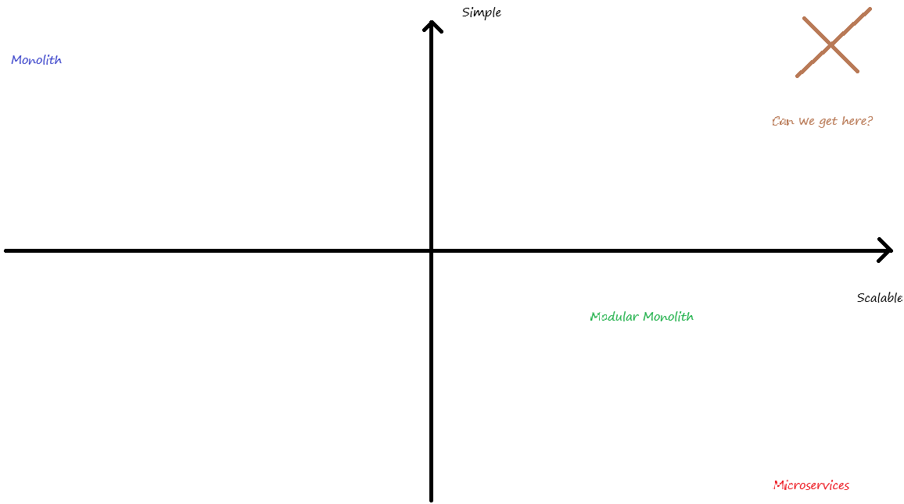
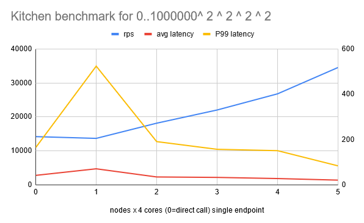

# My answer to microservices vs monoliths


As a backend developer and system architect, the biggest choice I have to make is how to balance the trade-offs 
of being simple efficient and scalable: keep the system in a monolithic architecture or split it into microservices.


### Microservices

It's usually considered as the advanced choice by most developers. Indeed, yes, it's the ultimate solution. 
And the team can enjoy some benefits other than performance and scalability, like independent deployment, minimized downtime,
flexible technology stack, etc. I can understand why developers are so hard on with it. However, the trade-offs are also
obvious: complexity, and cost. It's just too hard! Every time when developer ask me to use microservices architecture,
I would question about if we can do it right. To be honest even I am not that confident, especially after certain updates.
Please take a look at this if you question about it.

[](https://www.youtube.com/watch?v=y8OnoxKotPQ)

I can't stop laughing everytime when I watch it, but it's so true. You may read the comments and also [ThePrimeTime's react](https://www.youtube.com/watch?v=s-vJcOfrvi0) to it.
That's not hard to understand right? Just consider the spaghetti code you've ever written and imagine they are now in network calls, absolutely nightmare.


### Monolith

I love monoliths, if we can't foresee a million users or thousands of concurrency, who needs microservices?
It's way easier to develop, deploy and maintain. No need of to worry about service discovery, inter-service portal,
network drops, latency, blocking, timeout, etc. And as hardware performance and CI/CD technique improves,
a monolith on 100+ cores server with proper pipelines can well support a decent scaled system with minimal downtime.
When a single monolith can't handle alone, it can still scale itself horizontally, I would say >90% of the case it's sufficient.

### Modular Monolith

After considering all the pros and cons, developers nowadays seems not that into microservices. Big tech like Amazon, Google
are moving some of their less intensive products back to monoliths. But of course, that are big companies, and they always
prepare for growing fast and big in foreseeable future. So modular monoliths are their choice. For short, it's some microservices
running in a same process but still calling each other through network APIs. It's obviously easier than microservices and yet
more scalable than ordinary monolith. But from my understanding, it's not that ideal, just like the graph below.



The overhead of coding is still there no matter use Restful or gRPC or MQ. It requires a lot more efforts to manage the communication.
And obviously the performance overhead is there since it use network calls regardless of the fact that they are in the same process. 
Even if they can overcome that with some helper like fake client/server, it still increases the cost of implementation/splitting.
Moreover, in case if it needs to split one day, the cost is still not that low especially when taking deployment into consideration.

## My attempt: Kitchen

After all of these, I've come up with my own solution: Kitchen. I've set some goals for it:

1. Minimal development overhead
1. Minimal performance overhead
1. Seamless scaling
1. Manageable call stack
1. Manageable dependencies

### How it works

The core concept of Kitchen is to create placeholders for all major functions. These placeholders define the input, output, and dependencies required for execution. Function bodies can then be assigned to these placeholders.

At runtime, functions are invoked from the placeholders. This allows for the integration of additional logic such as logging, tracing, metrics, callbacks, and more into the function calls without messing up the code.

And most importantly, since execution is called via placeholders, it is not necessarily executed in local. Let's see how it hit my goals!

### Minimal development overhead

The major overhead of using kitchen is to predefine the placeholders before coding the actual logic.

```go
type SomeTaskes struct {
    kitchen.MenuBase[*SomeTaskes, *SomeDependecy]
    Task1 kitchen.Dish[*SomeDependecy, *Input1, *Output1]
    Task2 kitchen.Dish[*SomeDependecy, *Input2, *Output2]
}

someTaskes := kitchen.InitMen(&SomeTaskes{}, &SomeDependecy{})
someTaskes.Task1.SetCooker(func(dep *SomeDependecy, input *Input1, output *Output1) {
    // do something
})
someTaskes.Task2.SetCooker(doSomethingFn)

output1, err := someTaskes.Task1.Cook(input1)
```

It takes some time of course but compare to drafting APIs it's way easier. And Kitchen provides convenient plugins for turning the placeholders into web APIs, generating OpenAPI schema, and gRPC adapter etc.

### Minimal performance overhead

To be a framework for real battles, I've try put performance into first place, minimize the use of reflect or map. 
It makes the local call overhead is as low as <400ns, and <10000ns for network calls.

The network helper is based on ZeroMQ, which is a high-throughput, low-latency networking library. 
It's way faster than HTTP and gRPC, and I've further improved it by implementing a 2 way data link.
Every separated node will have a pool of tcp connections for sending request, but unlike traditional
network calls, they don't wait / block.And every node will have a listening port handling with single
goroutine, then requests will pass to the corresponding goroutine through channels. After the request
is processed, the response will be sent back through the request connections targeted to the requester.
This two-way data flow enabled a true async call, which is optimal for microservices use cases.




Note that the network helper is interchangeable, you can implement other helper to suit the requirement, for example
a MQ adapter is ideal for services require the highest level of durability.

### Seamless scaling

The network helper is designed to be configurable in runtime, service can easily replicate themselves into horizontal monoliths. 
Or they can even toggle feature scopes in runtime to become a single responsibility services by CI/CD pipeline or even APIs without restarting.
The core logic can stay unchanged as long as the dependencies are managed properly and the placeholders are properly defined.

### Manageable call stack

Metric, logger, tracer, etc are easy to implement, you can easily add them to the placeholders. The logger, tracer plugins
are provided by default, and additional plugins can be added by either tracer interface or as afterCook callback.

It also provided concurrent limit control, it's helpful to prevent part of service drain all the resource. Unfortunately,
the memory profile lib provided by golang messed up the generic type, so I can't provide a memory limit control.

Consider the placeholder as an internal URI, you can add all the things you previously did with middlewares to it.

### Manageable dependencies

It's important to keep dependencies manageable as we aim at split the modules one day.
It supports both singleton or factory / sync pool pattern. And they are injected into 
the function body inside the context parameter.

I am planning to add a dependency initialize and depose interface to let Kitchen prepare it for the corresponding functions are enabled and release resources when they are disabled.

And it can perform some extra logic like server middlewares by implementing certain interfaces, for example, IWebParsableInput for parsing web request into input
and handle session, ACL, etc.

### Conclusion

As a system architect, I am always dreaming of a perfect solution that can balance all the trade-offs, something that's easy to develop, deploy, and maintain, yet scalable and efficient.
One set of code suit all the scenarios with minimal modification, progressively scale as business growth.

Kitchen is my attempt to achieve this. I will keep improving it and hope it can help you as well. Any feedback is welcome.


Thank you for reading.
